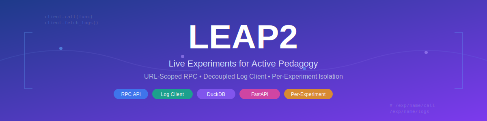

<div align="center">
  
</div>

# LEAP2

**Live Experiments for Active Pedagogy** — An interactive learning platform that exposes Python functions as RPC endpoints, logs every call, and serves per-experiment UIs for analysis and visualization.

LEAP2 is a clean-room reimplementation of LEAP, fixing tight coupling problems (visualizations calling API directly, hardcoded origins, active-experiment state) with a decoupled Log Client architecture and URL-scoped experiments.

## Features

- **RPC Server** — Drop Python functions into `experiments/<name>/funcs/` and they're automatically exposed as HTTP endpoints
- **Per-Experiment Isolation** — Each experiment has its own functions, UI, and DuckDB database
- **URL-Scoped** — All APIs live under `/exp/<name>/`; no hidden server state, fully bookmarkable
- **Automatic Logging** — Every RPC call is logged with args, result, timestamp, student ID, and trial
- **Student Registration** — Per-experiment registration with admin management; bulk CSV import via CLI, API, and UI
- **Per-Function Rate Limiting** — Default 120 calls/minute per student; override with `@ratelimit("10/minute")` or disable with `@ratelimit(False)`
- **Flexible Decorators** — `@nolog` for high-frequency calls, `@noregcheck` for open functions, `@ratelimit` for rate control
- **Decoupled Visualizations** — JS + Python Log Clients abstract log queries; visualizations depend on the client interface, not raw API calls
- **Rich Client** — Python RPCClient with `is_registered()`, `help()`, `fetch_logs()`, structured exception hierarchy (`RPCError`, `RPCNotRegisteredError`, etc.)
- **Admin Client** — Browser-side student management, log deletion, and function reloading via `adminclient.js`
- **Admin Log Management** — Delete individual log entries from the Logs page (admin only; with confirmation prompt)
- **Polished UI** — Glassmorphism navbar, dark/light themes, sparklines, inline counts, experiment version badges, grouped nav (experiment vs shared links), academic fonts for README/docs, syntax highlighting, floating TOC
- **CLI + Web** — Same logic powers both the `leap` CLI and the FastAPI web API
- **Filtered Log Queries** — Filter by student, function, trial, time range; cursor pagination
- **Export** — `leap export` to JSON Lines or CSV
- **CORS** — Configurable cross-origin support via `CORS_ORIGINS` env

## Quick Start

**Prerequisites:** Python 3.10+

```bash
# Install
pip install -e .

# Set admin password
leap set-password

# Start server (auto-creates project structure on first run)
leap run
```

Open http://localhost:9000 — the landing page lists available experiments.

## Project Structure

```
LEAP2/
├── leap/                    # Python package
│   ├── main.py              # FastAPI app, lifespan, CORS, static mounts
│   ├── config.py            # Root resolution, env vars
│   ├── cli.py               # Typer CLI (shared functions used by API too)
│   ├── core/                # Pure logic, no HTTP
│   │   ├── storage.py       # SQLAlchemy models, DuckDB CRUD
│   │   ├── rpc.py           # RPC execution, @nolog, @noregcheck, @ratelimit
│   │   ├── auth.py          # PBKDF2 hashing, credentials I/O
│   │   └── experiment.py    # Discovery, README parsing, function loading
│   ├── api/                 # FastAPI routers (thin wrappers over core)
│   │   ├── call.py          # POST /exp/<name>/call
│   │   ├── logs.py          # GET /exp/<name>/logs, log-options
│   │   ├── admin.py         # Admin endpoints (auth required)
│   │   ├── experiments.py   # Metadata, health, login/logout
│   │   └── deps.py          # Shared dependencies (experiment lookup, DB session, rate limiter)
│   ├── client/              # Python clients
│   │   ├── rpc.py           # Client / RPCClient (student-facing, with is_registered, help, fetch_logs)
│   │   └── logclient.py     # LogClient (log queries)
│   └── middleware/          # Auth dependency (require_admin)
├── ui/
│   ├── shared/              # theme.css, logclient.js, adminclient.js, navbar.js, footer.js, admin-modal.js, functions.html, students.html, logs.html, readme.html
│   ├── landing/             # Landing page (index.html) — experiment cards with sparklines, counts, version badges
│   └── 404.html             # Styled 404 page
├── experiments/
│   └── default/             # Bundled demo experiment
│       ├── README.md        # YAML frontmatter + instructions
│       ├── funcs/           # Python functions (auto-discovered)
│       ├── ui/              # optional; entry_point can be "readme" or a file in ui/
│       └── db/              # DuckDB file (gitignored)
├── config/                  # admin_credentials.json (gitignored)
├── tests/                   # pytest suite (460 tests)
└── pyproject.toml
```

## Architecture

### Design Goals

1. **Minimal required functionality** — Only essential features; quiz system, IDE dashboard deferred
2. **Decoupled visualizations** — Visualizations consume data via a Log Client interface, not direct `fetch` calls
3. **Clean architecture** — `core/` (pure logic), `api/` (thin HTTP routers), `middleware/`, `client/`
4. **Stable data contract** — Log schema is documented; visualizations depend on the contract, not the transport
5. **URL-scoped experiments** — No server-side "active" experiment; the URL path is the source of truth

### Decoupling Layer

The key architectural improvement over LEAP. Instead of visualizations calling `fetch("/logs?...")` directly:

```
Visualization → LogClient.getLogs() → HTTP API → Storage
```

The Log Client provides a stable interface (`getLogs`, `getLogOptions`, `getAllLogs`). Visualizations depend on the client, not the transport. This means:
- Visualizations can work against any backend (HTTP, file, mock)
- No hardcoded URLs or origin assumptions
- Schema changes are isolated to the client layer

### Separation of Concerns

- **Core** (`leap/core/`) — Pure logic, no HTTP: `rpc.py`, `storage.py`, `auth.py`, `experiment.py`
- **API** (`leap/api/`) — Thin FastAPI routers that call core functions
- **Middleware** — `require_admin` dependency checks session for `/exp/<name>/admin/*`
- **CLI** — Shared `_fn()` functions importable by both CLI and API; no logic duplication
- **UI** — `shared/` (cross-experiment), `landing/`, per-experiment `ui/`; login is handled via modal overlay

## Creating Experiments

```bash
leap new my-experiment
```

This scaffolds `experiments/my-experiment/` with a README, stub function file, and dashboard. Edit `funcs/functions.py` to add your own:

```python
def square(x: float) -> float:
    """Return x squared."""
    return x * x

def gradient_step(x: float, lr: float = 0.1) -> float:
    """One gradient descent step on f(x) = (x-3)^2."""
    return x - lr * 2 * (x - 3)
```

Public functions (names not starting with `_`) are auto-discovered and exposed at `POST /exp/my-experiment/call`. Functions prefixed with `_` are private — they stay hidden from the API but can be used as helpers by your exposed functions:

```python
import numpy as np

def _compute_gradient(x, y):
    """Internal helper — not exposed as an RPC endpoint."""
    return 2 * (x - 3), 200 * (y - x**2)

def gradient_step(x: float, y: float, lr: float = 0.01) -> dict:
    """One gradient descent step on the Rosenbrock function."""
    gx, gy = _compute_gradient(x, y)
    return {"x": x - lr * gx, "y": y - lr * gy}

_cache = {}

def predict(model_id: str, x: float) -> float:
    """Run prediction using a cached model."""
    if model_id not in _cache:
        _cache[model_id] = np.load(f"models/{model_id}.npy")
    return float(_cache[model_id] @ [1, x])
```

Use `_` prefixed names for shared math, caching, file I/O, validation, or any logic you don't want students to call directly.

Install experiments from Git:

```bash
leap install https://github.com/user/cool-lab.git
leap install https://github.com/user/cool-lab.git --name custom-name
```

If the cloned experiment contains a `requirements.txt`, `leap install` will automatically run `pip install -r requirements.txt` to install its dependencies into the current environment.

## Decorators

```python
from leap import nolog, noregcheck, ratelimit

@nolog
def step(dx):
    """Called at high frequency — not logged."""
    return dx * 2

@noregcheck
def echo(x):
    """Anyone can call this, no registration required. Still logged."""
    return x

@ratelimit("10/minute")
def expensive_simulation(x):
    """Costly computation — limited to 10 calls/min per student."""
    return run_sim(x)

@ratelimit(False)
def ping():
    """Unrestricted — no rate limit."""
    return "pong"
```

`@nolog` — Skip logging for high-frequency calls (real-time UI updates, animation, polling). The function still executes and returns results; it just doesn't create a log entry.

`@noregcheck` — Skip registration check for that function regardless of experiment setting. Useful when only some functions should be open (e.g. `echo()` for quick tests, `train()` requires registration).

`@ratelimit` — Control per-student rate limiting. All functions have a default rate limit of 120/minute per student. `@ratelimit("N/period")` overrides (period: `second`, `minute`, `hour`, `day`). `@ratelimit(False)` disables rate limiting entirely. Keyed by `(experiment, function, student_id)` — different students are independently limited.

Functions are reloaded at runtime via `POST /exp/<name>/admin/reload-functions` or the admin UI.

## Python RPC Client

Students interact with experiments via the Python client:

```python
from leap.client import Client

client = Client("http://localhost:9000", student_id="s001", experiment="default")
print(client.square(7))       # 49
print(client.add(3, 5))       # 8
```

`Client` is the preferred import name. The legacy name `RPCClient` still works as an alias.

### Available Methods

```python
# List and explore functions
client.help()                       # Pretty-print all functions with sigs, docs, badges
funcs = client.list_functions()     # Raw dict of function metadata

# Check registration
client.is_registered()              # True/False (uses /is-registered endpoint, zero side effects)

# Call functions (two styles)
client.square(7)                    # Dynamic dispatch
client.call("square", 7)           # Explicit

# Fetch logs
logs = client.fetch_logs(n=50)                          # Latest 50 logs
logs = client.fetch_logs(student_id="s001", trial="run-1")  # Filtered
logs = client.fetch_logs(func_name="square", order="earliest")
```

`help()` on any remote function shows its signature and docstring from the server:

```python
help(client.square)
# square(x: float)
#
# Return x squared.
```

The client discovers available functions at init via `GET /exp/<name>/functions`. The `trial_name` parameter tags all subsequent calls for log grouping:

```python
client = Client("http://localhost:9000", student_id="s001",
                 experiment="default", trial_name="bisection-run-1")
```

### Exception Hierarchy

The client raises structured exceptions for error handling:

```python
from leap.client import (
    RPCError,                # Base — catch-all
    RPCServerError,          # Non-2xx response
    RPCNetworkError,         # Connection/timeout failure
    RPCProtocolError,        # Invalid JSON or missing fields
    RPCNotRegisteredError,   # 403 — student not registered (subclass of RPCServerError)
)

try:
    result = client.square(7)
except RPCNotRegisteredError:
    print("Register first!")
except RPCNetworkError:
    print("Server unreachable")
except RPCError as e:
    print(f"Something went wrong: {e}")
```

Dynamic method access raises `AttributeError` with a hint to use `client.help()` when the function doesn't exist.

## Log Client (Decoupled Visualization)

Visualizations use the Log Client instead of calling the API directly.

**JavaScript** (browser, ES module):

```javascript
import { LogClient } from "/static/logclient.js";

const client = LogClient.fromCurrentPage();  // auto-detects experiment from URL
const { logs } = await client.getLogs({ funcName: "square", n: 50 });
const options = await client.getLogOptions();
const allLogs = await client.getAllLogs({ studentId: "s001" });  // auto-paginate
```

Works in browser and standalone JS (Node 18+, Deno) — zero dependencies, uses native `fetch`.

**Python** (notebooks, scripts):

```python
from leap.client import LogClient

client = LogClient("http://localhost:9000", experiment="default")
logs = client.get_logs(student_id="s001", func_name="square", n=50)
all_logs = client.get_all_logs(func_name="square")  # auto-paginate
options = client.get_log_options()
```

## Admin Client (Browser)

Manage students and reload functions from browser UIs:

```javascript
import { AdminClient } from "/static/adminclient.js";

const admin = AdminClient.fromCurrentPage();
await admin.addStudent("s001", "Alice");
const students = await admin.listStudents();
await admin.deleteStudent("s001");
await admin.reloadFunctions();
await admin.importStudents([{ student_id: "s002", name: "Bob" }]);
await admin.exportLogs("csv");                        // or "jsonlines"
await admin.changePassword("old-pass", "new-pass");
```

Requires an active admin session (cookie set by the login page). `fromCurrentPage()` detects the experiment from the URL path (`/exp/<name>/...`) or query param (`?exp=<name>`).

## Shared UI Pages

- **Functions** — `/static/functions.html?exp=<name>` — Function cards with syntax-highlighted signatures, docstrings (serif font), and decorator badges
- **Students** — `/static/students.html?exp=<name>` — Add, list, delete students with optional email field; search by ID/name, pagination, bulk CSV import with preview (admin required; shows auth gate when not logged in)
- **Logs** — `/static/logs.html?exp=<name>` — Real-time log viewer with auto-refresh, sparkline visualization, student/function/trial filters; admin users see per-row delete buttons
- **README** — `/static/readme.html?exp=<name>` — Rendered experiment README with academic fonts, syntax highlighting (highlight.js), line numbers, floating table of contents, and frontmatter banner

Shared pages receive the experiment name via the `?exp=` query parameter. Links from experiment UIs and the landing page include this parameter automatically.

### Navbar Structure

Experiment pages use a grouped navbar with a visual divider separating experiment-provided links from shared/static links:

```
[ Lab ]  |  Students (12)  Logs (347)  Functions (5)  README  All Experiments
 ↑ experiment  ↑ divider   ↑ shared (smaller, muted)
```

The navbar is rendered by `navbar.js` — a single shared script included by all pages. It reads `data-page` from `<body>` to highlight the current link, resolves the experiment name from the URL, and enriches link text with live counts from the API.

- **Left** — Experiment-specific links (Lab) at normal prominence
- **Divider** — Subtle vertical line (horizontal on mobile)
- **Right** — Shared links (`nav-shared` class) with inline counts fetched from `/api/experiments` and `/exp/<name>/log-options`

### Landing Page Cards

Each experiment card shows:
- **Title** with version badge (from frontmatter `version` field) and README link
- **Description** and "Open" badge (if `require_registration: false`)
- **Sparkline** — 14-day activity chart from recent log data
- **Buttons** — Students (N), Logs (N), Functions (N), Open — with counts inline; Students/Logs have orange hover to indicate admin-only

## Log Schema (Data Contract)

Every log entry returned by the API and Log Client follows this shape:

```json
{
  "id": 1,
  "ts": "2025-02-24T12:00:00Z",
  "student_id": "s001",
  "experiment": "default",
  "trial": "bisection-demo",
  "func_name": "square",
  "args": [7],
  "result": 49,
  "error": null
}
```

The DB stores raw JSON strings (`args_json`, `result_json` TEXT columns); the API parses them into `args` and `result` fields before returning.

## API Endpoints

**Experiment-scoped** (under `/exp/<name>/`):

| Endpoint | Method | Auth | Purpose |
|---|---|---|---|
| `/exp/<name>/call` | POST | — | Execute a function |
| `/exp/<name>/functions` | GET | — | List functions (signature, doc, nolog, noregcheck) |
| `/exp/<name>/logs` | GET | — | Query logs (filtered, paginated) |
| `/exp/<name>/log-options` | GET | — | Filter dropdown data (students, trials, log_count) |
| `/exp/<name>/is-registered` | GET | — | Check student registration |
| `/exp/<name>/readme` | GET | — | Experiment README (frontmatter + body) |
| `/exp/<name>/admin/add-student` | POST | Admin | Add student |
| `/exp/<name>/admin/import-students` | POST | Admin | Bulk-import students (JSON array) |
| `/exp/<name>/admin/students` | GET | Admin | List students |
| `/exp/<name>/admin/delete-student` | POST | Admin | Delete student + their logs |
| `/exp/<name>/admin/delete-log` | POST | Admin | Delete a single log entry |
| `/exp/<name>/admin/reload-functions` | POST | Admin | Reload functions from disk |
| `/exp/<name>/admin/export-logs` | GET | Admin | Export all logs (JSON; `?format=jsonlines\|csv`) |

**Root-level:**

| Endpoint | Method | Purpose |
|---|---|---|
| `/` | GET | Landing page (or redirect if `DEFAULT_EXPERIMENT` set) |
| `/api/experiments` | GET | List experiments with metadata (name, version, student_count, function_count) |
| `/api/health` | GET | Health check (`{ok, version}`) |
| `/api/auth-status` | GET | Check admin login (`{admin: true/false}`) |
| `/login` | GET/POST | Authenticate (JSON body; rate-limited to 5/min); GET redirects to landing |
| `/api/admin/change-password` | POST | Admin | Change admin password (requires current + new) |
| `/logout` | POST | Clear session |

**RPC payload:**

```json
POST /exp/default/call
{ "student_id": "s001", "func_name": "square", "args": [7], "trial": "run-1" }

Response: { "result": 49 }
Error:    { "detail": "..." }
```

**Function discovery** (`GET /exp/<name>/functions`):

```json
{
  "square": {
    "signature": "(x: float)",
    "doc": "Return x squared.",
    "nolog": false,
    "noregcheck": false,
    "ratelimit": "default"
  },
  "step": {
    "signature": "(student_id: str, dx: float = 0.0, dy: float = 0.0)",
    "doc": "Move the agent by (dx, dy). Called at high frequency by UI — NOT logged.",
    "nolog": true,
    "noregcheck": false,
    "ratelimit": "default"
  },
  "echo": {
    "signature": "(x)",
    "doc": "Return input unchanged. Open to all — no registration required. Still logged.",
    "nolog": false,
    "noregcheck": true,
    "ratelimit": "default"
  }
}
```

## Log Query Filters

`GET /exp/<name>/logs` supports:

| Param | Description |
|---|---|
| `sid` / `student_id` | Filter by student |
| `trial` / `trial_name` | Filter by trial |
| `func_name` | Filter by function (validated against registered functions) |
| `start_time` | ISO 8601 lower bound |
| `end_time` | ISO 8601 upper bound |
| `n` | Limit (1–10,000; default 100) |
| `order` | `latest` (default) or `earliest` |
| `after_id` | Cursor for pagination |

## Database Schema

Per-experiment DuckDB file at `experiments/<name>/db/experiment.db`. SQLAlchemy 2.0 ORM.

**students:**

| Column | Type | Constraints |
|---|---|---|
| `student_id` | VARCHAR | PRIMARY KEY |
| `name` | VARCHAR | NOT NULL |
| `email` | VARCHAR | NULL |

**logs:**

| Column | Type | Constraints |
|---|---|---|
| `id` | INTEGER | PRIMARY KEY (Sequence-based autoincrement) |
| `ts` | TIMESTAMP | NOT NULL, indexed |
| `student_id` | VARCHAR | NOT NULL, indexed |
| `experiment` | VARCHAR | NOT NULL, indexed |
| `trial` | VARCHAR | NULL |
| `func_name` | VARCHAR | NOT NULL, indexed |
| `args_json` | TEXT | NOT NULL |
| `result_json` | TEXT | NULL |
| `error` | TEXT | NULL |

The `experiment` column is redundant within a single per-experiment DB but kept for portability — enables merging DBs for cross-experiment analysis and exports.

## Authentication

- **Global** — One credentials file (`config/admin_credentials.json`); one login unlocks all experiments
- **Protected**: All `/exp/<name>/admin/*` endpoints
- **Public**: `/call`, `/functions`, `/logs`, `/log-options`, `/is-registered`, landing, login, health
- **Logs are public** — Anyone can query `/logs` (intentional for classroom visualizations); deleting logs requires admin

Credentials use PBKDF2-SHA256 (240,000 iterations). First run: if no credentials exist, set via `leap set-password` or `ADMIN_PASSWORD` env. Sessions use `SESSION_SECRET_KEY` env (random per restart if not set).

## Registration

**Experiment-level** — `require_registration` in README frontmatter (default `true`):
- `true`: `student_id` must exist in students table; 403 if not registered
- `false`: any `student_id` accepted; useful for open demos; logging still happens

**Per-function** — `@noregcheck` on a function skips registration regardless of experiment setting.

## CLI Commands

| Command | Purpose |
|---|---|
| `leap run` | Start the server (auto-bootstraps project structure on first run) |
| `leap new <name>` | Create experiment scaffold |
| `leap install <url>` | Clone experiment from Git; auto-installs `requirements.txt` if present |
| `leap list` | List experiments |
| `leap validate <name>` | Validate experiment setup |
| `leap export <exp> [--format]` | Export logs to `<exp>.jsonl` or `<exp>.csv` |
| `leap set-password` | Set admin password |
| `leap add-student <exp> <id>` | Add a student |
| `leap import-students <exp> <csv>` | Bulk-import students from CSV (see format below) |
| `leap list-students <exp>` | List students |
| `leap config` | Show resolved configuration |
| `leap doctor` | Validate full setup (Python, packages, dirs, credentials) |
| `leap version` | Show version |

### Student CSV Format

The CSV file for `leap import-students` must have a header row with a `student_id` column. The `name` and `email` columns are optional.

```csv
student_id,name,email
s001,Alice,alice@example.edu
s002,Bob,bob@example.edu
s003,Charlie,
```

- **`student_id`** (required) — Unique identifier for the student.
- **`name`** (optional) — Defaults to the `student_id` if not provided or empty.
- **`email`** (optional) — Can be left blank.

Duplicates (students whose `student_id` already exists) are skipped, not overwritten. The command reports how many were added, skipped, and errored.

The same format is accepted by the API (`POST /exp/<name>/admin/import-students` with a JSON array) and the Students UI page (file upload or paste).

## Environment Variables

| Variable | Default | Purpose |
|---|---|---|
| `LEAP_ROOT` | cwd | Project root directory |
| `DEFAULT_EXPERIMENT` | _(none)_ | Redirect `/` to this experiment's UI |
| `ADMIN_PASSWORD` | _(none)_ | Non-interactive password setup |
| `SESSION_SECRET_KEY` | _(random)_ | Stable session key for production |
| `CORS_ORIGINS` | _(none)_ | Comma-separated allowed origins (e.g. `http://localhost:3000,https://myapp.edu`) |
| `LEAP_RATE_LIMIT` | `1` (enabled) | Set to `0` to disable the global SlowAPI rate limiter (login throttling, etc.) |
| `LOG_LEVEL` | `INFO` | Python logging level |

## Development

```bash
# Install with dev dependencies
pip install -e ".[dev]"

# Run tests (460 tests)
pytest tests/

# Run with auto-reload
uvicorn leap.main:app --reload --port 9000
```

### Test Structure

```
tests/
├── conftest.py               # Shared fixtures (tmp_root, tmp_credentials)
├── core/                     # storage, auth, experiment, rpc (194 tests)
├── api/
│   ├── test_api.py           # Full API integration (80 tests)
│   ├── test_ui_serving.py    # Static mounts, landing, login (22 tests)
│   └── test_phase4.py        # Shared pages, CORS, function flags (15 tests)
├── client/
│   ├── test_rpcclient.py     # RPCClient: call, dispatch, help, is_registered, fetch_logs, exceptions (42 tests)
│   └── test_logclient.py     # Python LogClient (23 tests)
└── cli/
    ├── test_cli_phase2.py    # new, list, validate, config, doctor (51 tests)
    ├── test_cli_phase3.py    # install, pip deps (19 tests)
    └── test_cli_phase4.py    # export (14 tests)
```

All tests use isolated temp directories with per-test DuckDB instances. No shared state.

## Experiment README Format

Each experiment has a `README.md` with YAML frontmatter:

```markdown
---
name: default
display_name: Default Lab
description: Basic RPC lab with square, cubic, Rosenbrock.
version: "1.0.0"
entry_point: readme
leap_version: ">=1.0"
require_registration: true
---

# Instructions

1. Register your student ID.
2. Use the RPC client to call functions.
```

| Field | Default | Description |
|---|---|---|
| `name` | folder name | Identifier (folder name is source of truth for routing) |
| `display_name` | folder name | Human-readable name |
| `description` | `""` | Short description |
| `version` | `""` | Experiment version (shown on landing page card) |
| `entry_point` | `readme` | `readme` = experiment README page; or a UI file in `ui/` (e.g. `dashboard.html`) |
| `leap_version` | _(none)_ | Minimum LEAP2 version required (enforced; `>=1.0`, `==1.0.0`, or bare `1.0`) |
| `require_registration` | `true` | Require student registration for RPC |

Experiment names must match `[a-z0-9][a-z0-9_-]*` (lowercase, digits, hyphens, underscores). Invalid folder names are skipped at discovery with a warning.

## Planned

Not yet implemented — tracked for future work.

**Documentation (`docs/` folder):**

| Doc | Audience | Scope |
|---|---|---|
| `CLI.md` | Admins | Full command reference with examples |
| `LOG_CLIENT.md` | Viz authors | JS + Python API, baseUrl, browser + standalone |
| `ADMIN_CLIENT.md` | Admin UI authors | Methods, auth, baseUrl conventions |
| `RPC_CLIENT.md` | Students | RPCClient usage, trial, discovery |
| `DECORATORS.md` | Experiment authors | `@nolog`, `@noregcheck`, when to use |
| `DATA_CONTRACT.md` | API consumers | Log schema, query params, stable contract |
| `RUNBOOK.md` | Ops | Start/stop, env vars, credentials, troubleshooting |

Currently the README covers all of this in condensed form.

**Features:**

- **Algorithm visualizations** — Port BFS grid, gradient descent, Monte Carlo, power method from LEAP using the Log Client (experiment-specific, in `experiments/<name>/ui/`)
- **Quiz system** — Deferred from LEAP
- **Monaco/uPlot IDE dashboard** — Rich in-browser coding + plotting
- **DB migrations** — Schema versioning for future LEAP2 changes
- ~~**Experiment dependencies**~~ — Implemented: `leap install` auto-runs `pip install -r requirements.txt` if present in the cloned experiment
- **WebSocket real-time** — Push log updates to browser instead of polling
- ~~**Admin Client extensions**~~ — Implemented: `changePassword` (`POST /api/admin/change-password`), `exportLogs` (`GET /admin/export-logs`)
- ~~**`leap_version` enforcement**~~ — Implemented: parsed from frontmatter and checked at discovery; `leap validate` reports version mismatches

## License

MIT
